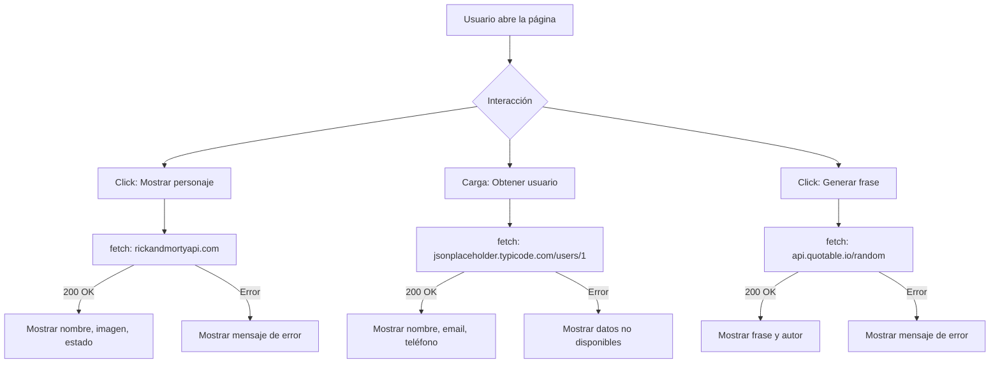

# Ejecutar proyecto - APIS

Guía paso a paso para ejecutar este proyecto en Visual Studio Code (Windows).

---

## Requisitos (elige una opción)
- Node.js (recomendado) — incluye `npm`/`npx`. Descárgalo desde https://nodejs.org (elige LTS).
- Python 3 (alternativa) — para `python -m http.server`.
- Extensión **Live Server** de VS Code (más simple, sin instalar Node/Python).

Comprueba si ya están instalados en la terminal integrada de VS Code:

```bash
node -v
npm -v
py -3 --version   # o python --version
```

---

## Estructura de archivos
- `index.html` — página principal.
- `css/estilos.css` — estilos.
- `js/script.js` — lógica JavaScript (fetch a las APIs).

---

## Opciones para ejecutar (elige una)

1) Usar la extensión Live Server (fácil)

  - En VS Code abre la vista de extensiones (Ctrl+Shift+X).
  - Busca `Live Server` (by Ritwick Dey u otra popular) e instálala.
  - Abre `index.html` en el editor.
  - Haz clic derecho y selecciona **Open with Live Server** o pulsa el botón **Go Live** en la barra inferior.
  - Se abrirá el navegador con una URL `http://127.0.0.1:5500` o similar.

2) Usar `http-server` con Node (permanente/global)

  - Instala Node.js desde https://nodejs.org si aún no está.
  - Instala `http-server` globalmente (requiere permisos de usuario):

  ```bash
  npm install -g http-server
  ```

  - Abre la terminal integrada en VS Code (Ctrl+`), navega a la carpeta del proyecto:

  ```bash
  cd "C:\Users\rodri\OneDrive\Escritorio\APIS"
  ```

  - Inicia el servidor en el puerto 5500:

  ```bash
  http-server -p 5500
  ```

  - Abre en el navegador: `http://127.0.0.1:5500`.
  - Para detener el servidor: en la terminal presiona `Ctrl+C`.

  - Alternativa sin instalar globalmente (usa `npx`):

  ```bash
  npx http-server -p 5500
  ```

3) Usar Python (si está instalado)

  - En la terminal integrada, desde la carpeta del proyecto:

  ```bash
  cd "C:\Users\rodri\OneDrive\Escritorio\APIS"
  py -3 -m http.server 5500
  # o
  python -m http.server 5500
  ```

  - Abrir `http://127.0.0.1:5500` en el navegador.

---

## Pruebas rápidas (qué verificar)

- Abre las DevTools del navegador (F12) y revisa la pestaña **Console** y **Network** para errores.
- En la página:
  - Ejercicio 1: pulsa **Mostrar personaje** — debe aparecer nombre, imagen y estado.
  - Ejercicio 2: al cargar la página verás Nombre, Email y Teléfono.
  - Ejercicio 3: pulsa **Generar frase** — debe aparecer frase y autor.

## Errores comunes y soluciones

- ERR_CONNECTION_REFUSED: asegúrate de que el servidor esté corriendo en la terminal. Si aparece, prueba `http://127.0.0.1:5500` en vez de `localhost`.
- Puerto en uso: cambia el puerto (por ejemplo `-p 8080`).
- 404 en CSS/JS: confirma que `index.html` referencia `css/estilos.css` y `js/script.js` y que esas carpetas existen.
- CORS u otros errores de fetch: abre la consola y revisa la respuesta; las APIs usadas son públicas y deberían permitir peticiones desde el navegador.
- Firewall/antivirus: si el servidor arranca pero el navegador no se conecta, puede estar bloqueando el puerto.

---

## Ejecutar desde VS Code (resumen rápido)

1. Abre la carpeta del proyecto en VS Code: `File > Open Folder...` y selecciona `APIS`.
2. Abre la terminal integrada: `Ctrl+` (acento grave).
3. Elige una de las opciones anteriores para levantar el servidor (Live Server, `http-server`, `python`).
4. Abre `http://127.0.0.1:5500` en el navegador.

---

Si quieres, puedo:
- arrancar el servidor ahora en este entorno (ya tengo permisos para usar `npx http-server`), o
- automatizar la comprobación de `node`/`python` e imprimir los pasos exactos para tu máquina.

Dime qué prefieres y lo hago.

---

## Flujos y diagramas

A continuación tienes diagramas de flujo (Mermaid) que representan el comportamiento de la página y de cada ejercicio.

**Diagrama general:**


**Flujo Ejercicio 1 (Personaje aleatorio):**
```mermaid
flowchart LR
  Btn[Usuario pulsa "Mostrar personaje"] --> Fetch[fetch() a /api/character/{id}]
  Fetch -->|éxito| Render[Renderizar nombre, imagen, estado]
  Fetch -->|fallo| Error[Mostrar 'Error al obtener el personaje']
```

**Flujo Ejercicio 2 (Datos de usuario al cargar):**
```mermaid
flowchart LR
  Load[Evento DOMContentLoaded] --> FetchU[fetch() a /users/1]
  FetchU -->|éxito| RenderU[Mostrar nombre, email, teléfono]
  FetchU -->|fallo| ErrorU[Mostrar 'No disponible']
```

**Flujo Ejercicio 3 (Frase aleatoria):**
```mermaid
flowchart LR
  BtnF[Usuario pulsa "Generar frase"] --> FetchF[fetch() a /random]
  FetchF -->|éxito| RenderF[Mostrar frase y autor]
  FetchF -->|fallo| ErrorF[Mostrar 'No se pudo obtener la frase']
```

Notas rápidas:
- Todos los fetch usan `.then(...).catch(...)` para manejo básico de errores.
- Revisa la consola (F12) si algo falla: verás la respuesta de la API o el error que lanzó `fetch`.
- Si quieres, genero diagramas en PNG/SVG exportados desde Mermaid y los añado al repo.
